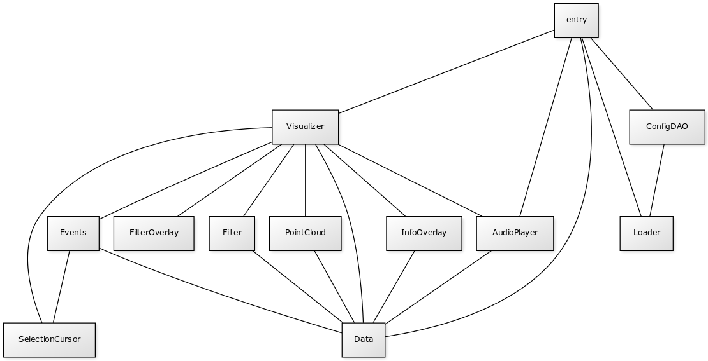

# Application Architecture

The visualization is written in Javascript mainly using the [three.js](https://threejs.org/) WebGL library. When a user loads the app a node.js server serves index.html page that contains the bundled javascript made by webpack. 

Entry.js, using ConfigDAO.js, starts the loading process of concatenated audio files for fast playback and also starts loading the visualization data. All elements are created and then populated after the data loading is complete. Entry also contains the functionality to change between data sets.

Data.js parses the .json file of the currently active dataset and serves as an interface to the parsed data. Almost all other modules utilize Data.js.

Visualizer.js serves as a center point to most other functionality. Visualizer.js creates a webGL scene, adds an orthographical camera and functionality for moving the scene around. It creates a new PointCloud object and inserts it to the scene.

PointCloud.js handles the creation and updating of the actual points on screen. Size and color change calculations are done using shaders to make them as fast as possible.

Events.js has event listeners which react to user input. These include zooming, panning and clicking buttons.

Filter.js activates and deactivate points based on the filter status passed on by FilterOverlay.js. It also contains functionality for manual selection of points.

FilterOverlay.js creates the controls on the left side of the screen that contains filters and data set selection. It uses [dat.gui](https://github.com/dataarts/dat.gui) which we have [forked](https://github.com/SSGL-SEP/dat.gui) to add our own functionality to it.

InfoOverlay.js creates all other overlays: mouse over, clicked on point info and selection information. These are all html div elements drawn on top of the webGL scene.

SelectionCursor.js handles the selection and removing mode indicators.

AudioPlayer.js contains controls to start and stop playing of sound files.

Loader.js is used for loading json and concatenated audio files.

